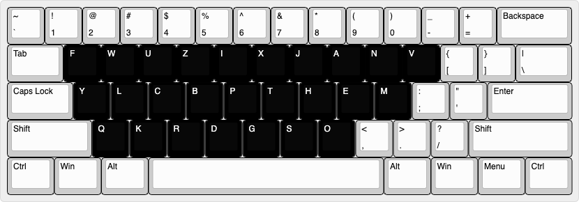

# FWUZIX Layout

A new keyboard layout generated by pairing the shortest-delay keys with the most common letter-pairs.



## Method

Please see the `method` directory for Jupyter Notebooks outlining the process. Simply, the 136M Keystrokes Dataset was used to extract average key-press delays and the most common letter-pairs were derived from the Blog Authorship Corpus. The shortest-delay keys were then replaced with the most common letter-pairs to form the FWUZIX layout.

## Analysis

<https://patorjk.com/keyboard-layout-analyzer/#/load/X6Wb6nVM>

[Analysis PDF](analysis.pdf)

## Attributions

[136M Keystrokes Dataset](https://userinterfaces.aalto.fi/136Mkeystrokes/)

[Blog Authorship Corpus](https://huggingface.co/datasets/blog_authorship_corpus)

```
@inproceedings{dhakal2018observations,
    author = {Dhakal, Vivek and Feit, Anna and Kristensson, Per Ola and Oulasvirta, Antti},
    booktitle = {Proceedings of the 2018 CHI Conference on Human Factors in Computing Systems (CHI '18)},
    title = {{Observations on Typing from 136 Million Keystrokes}},
    year = {2018}
    publisher = {ACM}
    doi = {https://doi.org/10.1145/3173574.3174220}
    keywords = {text entry, modern typing behavior, large-scale study}
}

@inproceedings{schler2006effects,
    title={Effects of age and gender on blogging.},
    author={Schler, Jonathan and Koppel, Moshe and Argamon, Shlomo and Pennebaker, James W},
    booktitle={AAAI spring symposium: Computational approaches to analyzing weblogs},
    volume={6},
    pages={199--205},
    year={2006}
}
```
